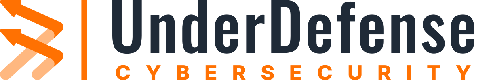

<picture>
  <source media="(prefers-color-scheme: dark)" srcset="./assets/underdefense-logo-white.svg">
  
</picture>

# Agentic AI SOC: Research on How It Works and How to Choose a Vendor

> Research for security teams whose alert volume has outrun the SOC and who are deciding how to scale operations: add people, or add AI agents that triage and investigate at machine speed with humans in control. Covers what SOC triage at scale actually costs, how agentic AI SOC compares to a traditional or in-house SOC, autonomy and explainability, provider evaluation, pricing, and rollout. Maintained by [UnderDefense](https://underdefense.com).

---

### What this research covers

A practitioner's view of an agentic AI SOC and the decision that leads to it: whether to handle growing alert volume by scaling the human SOC, or by adding AI agents that do the triage and investigation work with analysts still owning the decisions. Reading it, you will:

- see what SOC triage at scale actually costs in analyst time, dwell time, and staffing, beyond any tooling;
- compare the human-scaling and agentic models on cost, coverage, speed, and control;
- get the criteria to evaluate AI SOC vendors, with a [33-question vendor scorecard (PDF)](./assets/UnderDefense-AI-SOC-Vendor-Scorecard.pdf) and an [ROI model (XLSX)](./assets/UnderDefense-AI-SOC-ROI-Calculator.xlsx) you can run on your own numbers.

For a read on your own environment, UnderDefense will **[map where agents help, where a human still decides, and what the evidence trail looks like](https://underdefense.com/contact/)**. No commitment; the output is usable in your planning either way.

---

## What SOC triage at scale actually costs

The tooling is the visible spend. The recurring cost is the work of turning alerts into decisions, and that is where a SOC either scales or drowns.

A SIEM, EDR, and cloud stack together produce thousands of alerts a day. Most are false positives or low-value, and Tier-1 analysts spend the shift enriching, checking, and closing them rather than investigating anything real. Alert fatigue is the most common failure mode of a growing SOC, and it worsens as log sources are added.

Speed is the second cost. Manual triage means hours of dwell time on the alerts that do matter, while an attacker who lands a valid credential moves in minutes. The gap between mean time to detect and the speed of the intrusion is where breaches happen, and adding dashboards does not close it.

Coverage is a staffing problem before it is a technology one. Round-the-clock monitoring across nights, weekends, and holidays takes roughly five to six analysts once shift rotation, on-call, PTO, and attrition are counted. Tier-1 is the highest-churn role in security, and every departure resets hiring, onboarding, and the detection knowledge that left with the person. The economics scale the wrong way: each new log source adds alerts, which adds analyst hours, so cost tracks data volume rather than risk reduced.

None of this is a reason to adopt AI by default. It is the workload any SOC has to cover somehow, and the baseline against which machine-speed triage is worth comparing.

## Two ways to handle SOC operations at scale

With the workload in view, the question is not "do we need an AI SOC." It is how to cover the triage and investigation load as it grows: scale the human SOC, or add AI agents that do the first-line work while analysts keep the decisions. Both are legitimate, and the right one depends on your constraints.

**Option 1, scale with people.** Grow the internal SOC or add a traditional human-led MDR: more Tier-1 analysts, 24/7 shift coverage, alert-by-alert triage, hiring and retention, human-speed response, and cost that rises with alert volume. The upside is full human judgment, an established model, and no questions about trusting AI. The cost is headcount that scales with volume and the Tier-1 fatigue and churn that come with it.

**Option 2, agentic AI SOC.** AI agents run triage and investigation at machine speed on the stack you already have, and analysts authorize every response decision. Most noise is filtered before it reaches a person, and coverage is round-the-clock without hiring for shift rotation. The trade-off is that you have to demand explainable decisions and verify the AI is real, not an LLM chatbot layered on a legacy SIEM.

### Modeling the difference at scale

The two models diverge as alert volume grows. Scaling with people adds headcount at each tier, so operating cost tracks alert volume. Agentic triage absorbs the volume, so the human team stays roughly flat and cost tracks endpoints rather than alerts.

Modeled at a mid-size environment (~8,000 alerts/day):

| | Scale with people | Agentic AI SOC |
|---|---|---|
| Analysts for 24/7 coverage | ~9, rising with volume | small flat team, supervising |
| Alerts a person touches | most of them | roughly 1% (the rest filtered) |
| Mean time to triage | hours | minutes (2-minute standard) |
| Cost as volume grows | linear | sub-linear |

Illustrative, based on published 24/7 staffing benchmarks and a loaded analyst cost near $110k. Model your own inputs in the [ROI calculator](./assets/UnderDefense-AI-SOC-ROI-Calculator.xlsx).

Where the research goes deeper on each step:

| Question | Where to read |
|---|---|
| What is an agentic AI SOC, and how do the agents work? | [`research/what-is-agentic-ai-soc`](./research/what-is-agentic-ai-soc) |
| Scale with people, or with agents? | [`research/agentic-vs-traditional-soc`](./research/agentic-vs-traditional-soc) |
| If agents, which vendor and on what criteria? | [`research/how-to-evaluate-vendors`](./research/how-to-evaluate-vendors) · [`research/buying-guide`](./research/buying-guide) |
| How does it deploy, and in my industry? | [`research/implementation`](./research/implementation) · [`research/industries`](./research/industries) |

### How one team decided

Neither model is universally right, so the decision comes down to constraints. One example from our client base: the security lead at a regulated fintech scale-up, with a lean team and alert volume from cloud and SaaS growing faster than they could hire. They weighed adding Tier-1 headcount against agentic triage. What decided it was specific to their situation: 24/7 coverage they could not staff, constant Tier-1 churn, and a SOC 2 audit that required a defensible evidence trail for every action. They kept their existing SIEM and EDR and moved the triage and response workload to agents with analysts in control.

For teams that reach the same conclusion, UnderDefense operates an agentic AI SOC on the stack you already run: AI agents handle triage and investigation, analysts own the decisions, and every action leaves an explainable, auditable trail.

**[Request a SOC assessment](https://underdefense.com/contact/)** · **[Technical walkthrough](https://underdefense.com/book-a-personal-demo-24-7-mdr-and-response/)**

## How an agentic AI SOC works

The question a technical buyer actually has about AI in the SOC is not "what is it." It is whether an autonomous system will make decisions about the environment that cannot be seen, explained, or undone. The honest answer in one diagram:

Three points that decide whether the model is trustworthy:

- **The AI does not act on its own.** Agents triage and investigate and recommend; a human authorizes the response, with per-action approval, scoping by asset class, a kill switch, and user verification before containment.
- **It is not a black box.** Every decision produces a human-readable evidence trail you can audit and export for SOC 2, HIPAA, and ISO 27001.
- **It does not replace your stack or your team.** It runs on the tools you already own and does the first-line work so analysts spend their time on decisions, not triage.

The line that separates a platform from a demo: most vendors sell autonomous detection but deliver autonomous alerting, where the alert still lands in your queue. The model worth paying for pairs AI triage with analysts who act on your behalf, so response does not bounce back to your team.

## Evaluating AI SOC vendors

Compare vendors on facts you can verify, not on the word "autonomous." The criteria that decide the outcome: does the platform close the loop to response or stop at an alert, are there real guardrails on autonomous action, does it run on your existing stack, and is pricing published. Full methodology and per-vendor detail: [9 Best AI SOC Providers in 2026](./research/how-to-evaluate-vendors/best-ai-soc-providers-2026.md).

| Provider | Closes the loop to response? | Autonomy guardrails | Runs on your stack? | Pricing |
|---|---|---|---|---|
| **UnderDefense** | AI triage plus analysts who act on your behalf | Human authorization, asset-class scoping, kill switch, user verification | Open; 250+ integrations | Published per-endpoint |
| CrowdStrike (Charlotte AI) | Strong within Falcon | Configurable | Falcon ecosystem | Quote-based |
| Palo Alto (Cortex XSIAM) | Platform-native | Configurable | Requires the Cortex platform | Quote-based |
| Microsoft (Security Copilot) | Assists analysts | Analyst-in-the-loop | M365 / Sentinel ecosystem | Consumption-based |
| Arctic Wolf | Concierge, human-led | Human-led | Proprietary platform | Contact sales |
| Stellar Cyber (Open XDR) | Detection-led | Configurable | Open; any EDR | Quote-based |

The line that separates the field is whether the platform closes the loop to response and runs on the stack you own, or stops at an alert inside one vendor's ecosystem. If you want a single-vendor platform where the AI is tuned to one vendor's telemetry, Cortex- or Falcon-native options serve that better. If you need coverage across an open, mixed stack with response that closes the loop, that is the model we built.

---

## `research/what-is-agentic-ai-soc`

_What an agentic AI SOC is, how the agents are built, how autonomy and explainability work in practice, and where the category is heading in 2026._

- [AI SOC Agents: Architecture, Evaluation, and the 2026 Vendor Comparison](./research/what-is-agentic-ai-soc/ai-soc-agents-explained.md)
- [AI SOC Explainability: Evidence Trails, Accuracy Benchmarks, and Decision Accountability](./research/what-is-agentic-ai-soc/ai-soc-explainability.md)
- [AI SOC Guide: Architecture, Capabilities, Pricing, and Migration Playbook](./research/what-is-agentic-ai-soc/ai-soc-complete-guide.md)
- [AI SOC Trends 2026: Benchmarks, Maturity Levels, and What Separates Early Adopters](./research/what-is-agentic-ai-soc/ai-soc-trends-2026.md)
- [Autonomous SOC Guide: AI Alert Triage, Agentic Response, Vendor Evaluation, and ROI Roadmap](./research/what-is-agentic-ai-soc/autonomous-soc-guide.md)
- [What Is an AI SOC? A Complete Guide to How AI Security Operations Work](./research/what-is-agentic-ai-soc/what-is-an-ai-soc.md)

## `research/agentic-vs-traditional-soc`

_The core decision: scale the SOC with people or with agents. Agentic AI SOC measured against a traditional SOC, in-house builds, MDR, MSSP, SIEM, and EDR, with the trade-offs stated plainly._

- [AI SOC + EDR: 5 Blind Spots That CrowdStrike and SentinelOne Miss](./research/agentic-vs-traditional-soc/ai-soc-plus-edr-blind-spots.md)
- [AI SOC vs MDR vs MSSP: Scoring Table, Pricing Data, Response Proof](./research/agentic-vs-traditional-soc/ai-soc-vs-mdr-vs-mssp.md)
- [AI SOC vs Traditional SOC: Rules vs. Intelligence, Manual vs. Automated Triage](./research/agentic-vs-traditional-soc/ai-soc-vs-traditional-soc.md)
- [AI SOC vs. In-House SOC: 3-Year TCO Data Most Vendors Won't Publish](./research/agentic-vs-traditional-soc/ai-soc-vs-in-house-soc.md)
- [Do I Need AI SOC If I Have SIEM? Keep Your Stack, Close the Response Gap](./research/agentic-vs-traditional-soc/ai-soc-vs-siem.md)

## `research/how-to-evaluate-vendors`

_The selection toolkit: the 33-question evaluation framework, feature checklists, and named-vendor rankings by segment. Pair it with the downloadable scorecard._

- [33 Questions to Ask While Evaluating AI SOC Vendors](./research/how-to-evaluate-vendors/33-vendor-evaluation-questions.md)
- [8 Best Agentic SOC Platforms for 2026: Independent Comparison](./research/how-to-evaluate-vendors/best-agentic-soc-platforms.md)
- [9 Best AI SOC Providers in 2026: A Complete Vendor Comparison](./research/how-to-evaluate-vendors/best-ai-soc-providers-2026.md)
- [9 Best AI SOC for Enterprise: Evaluation With Pricing and Reviews](./research/how-to-evaluate-vendors/best-ai-soc-enterprise.md)
- [Best AI SOC for Mid-Market: 8 Providers Scored, Priced, Ranked](./research/how-to-evaluate-vendors/best-ai-soc-mid-market.md)
- [Best AI SOC for SMBs: 6 Vendors Scored With Real Pricing (2026)](./research/how-to-evaluate-vendors/best-ai-soc-smb.md)
- [What Features Should AI SOC Have in 2026? A Complete Checklist](./research/how-to-evaluate-vendors/ai-soc-features-checklist.md)

## `research/buying-guide`

_The business case: pricing models, the ROI math, breach-warranty terms, and SLA benchmarks to hold a vendor to._

- [AI SOC Pricing Guide 2026: Complete Cost Breakdown](./research/buying-guide/ai-soc-pricing-guide-2026.md)
- [AI SOC SLA in 2026: MTTR, Benchmarks, Clause Tables, Negotiation Checklist](./research/buying-guide/ai-soc-sla-2026.md)
- [AI SOC Breach Warranty Guide: What Financial Protection Providers Actually Offer](./research/buying-guide/ai-soc-breach-warranty.md)
- [ROI of AI in SOC: Calculate Analyst Savings and Breach Avoidance](./research/buying-guide/roi-of-ai-soc.md)

## `research/implementation`

_Deployment models, integration with SIEM, EDR, and cloud, maturity phases and timelines, automation roadmaps, and day-to-day operational practice._

- [24/7 Security Monitoring Without Growing Your Team: A Practitioner's Blueprint](./research/implementation/24-7-monitoring-without-growing-team.md)
- [AI SOC Automation in 2026: Agentic Triage, Maturity Model, ROI, and Implementation](./research/implementation/ai-soc-automation-2026.md)
- [AI SOC Best Practices: Autonomous Response, MITRE Mapping, Anti-Patterns, and ROI](./research/implementation/ai-soc-best-practices.md)
- [AI SOC Deployment Models Explained: SaaS, BYOC, On-Premise, and Air-Gapped](./research/implementation/ai-soc-deployment-models.md)
- [AI SOC Integration Guide: SIEM, EDR, Cloud Compatibility Explained](./research/implementation/ai-soc-integration-guide.md)
- [AI SOC Investigation Speed: How We Cut 1,000 Alerts to 6 Real Cases](./research/implementation/ai-soc-investigation-speed.md)
- [The Complete AI SOC Implementation Guide: Maturity Phases, Architecture, and Metrics](./research/implementation/ai-soc-implementation-guide-maturity.md)
- [The Complete AI SOC Implementation Guide: Timelines, Checklists, and Best Practices](./research/implementation/ai-soc-implementation-guide-timelines.md)

## `research/industries`

_Vertical specifics for regulated and high-volume environments: healthcare, financial services, SaaS, private-equity portfolios, and compliance-driven monitoring._

- [AI SOC Compliance Edge: How Continuous Monitoring Beats Periodic Log Checks](./research/industries/ai-soc-compliance-edge.md)
- [AI SOC for Financial Services: Payment Rails, Trading, and Compliance Defense](./research/industries/ai-soc-for-financial-services.md)
- [AI SOC for Healthcare: Defend EHRs and Automate HIPAA Compliance](./research/industries/ai-soc-for-healthcare.md)
- [AI SOC for PE Portfolios: One Platform, 15 Portfolio Companies, Zero Rip-and-Replace](./research/industries/ai-soc-for-pe-portfolios.md)
- [AI SOC for SaaS: Protect CI/CD Pipelines, APIs, and OAuth Tokens](./research/industries/ai-soc-for-saas.md)

---

## How UnderDefense operates an agentic AI SOC

UnderDefense operates an open, vendor-agnostic agentic AI SOC: AI agents perform triage and investigation, human analysts own the decisions, and the pipeline runs on the stack you already own.

- **Machine-speed first line, humans in control.** Agents triage and investigate; analysts authorize response. Guardrails include per-action approval, asset-class scoping, a kill switch, and user verification before containment.
- **Every decision is explainable and auditable.** Human-readable evidence trails, exportable for SOC 2, HIPAA, and ISO 27001.
- **Open and multi-environment.** Runs on your SIEM, EDR, cloud, and identity tools. 250+ integrations, no rip-and-replace.
- **It closes the loop to response.** AI triage plus analysts who act on your behalf, with a 2-minute alert-to-triage and 15-minute critical escalation standard.
- **Proven in operation:** roughly 99% noise reduction, 96% MITRE ATT&CK coverage, and zero ransomware incidents across 6 years.
- **How clients usually find us:** auditor and compliance-partner referrals (PCI DSS, SOC 2 networks), the channel where a vendor gets recommended only if past engagements held up. 500+ clients globally, 4.9/5 on [Gartner Peer Insights](https://www.gartner.com/reviews/market/managed-detection-and-response/vendor/underdefense) from verified reviews, plus [G2](https://www.g2.com/sellers/underdefense). Check the independent reviews before taking any claim on this page at face value.

Test it against your environment: **[SOC assessment](https://underdefense.com/contact/)** or **[technical walkthrough](https://underdefense.com/book-a-personal-demo-24-7-mdr-and-response/)**.

## Key topics covered

Agentic AI SOC · AI SOC · Autonomous SOC · AI SOC vs traditional SOC · AI SOC vs in-house SOC · AI SOC vs MDR · AI SOC vs MSSP · AI SOC vs SIEM · AI SOC and EDR · AI alert triage · Agentic response · Autonomy guardrails · Explainability · Evidence trails · MITRE ATT&CK coverage · False-positive reduction · MTTD · MTTR · Investigation speed · Vendor evaluation · 33-question scorecard · AI SOC pricing · ROI · Breach warranty · SLA benchmarks · Deployment models (SaaS, BYOC, on-prem, air-gapped) · SIEM, EDR, and cloud integration · Healthcare · Financial services · SaaS security · PE portfolios · Compliance.

## Contributing

Factual errors, dead links, and new research notes: open an [issue](../../issues) or submit a PR. See [CONTRIBUTING.md](./CONTRIBUTING.md).

## License

Published under [Creative Commons Attribution 4.0 International (CC BY 4.0)](./LICENSE). Share and adapt for any purpose, including commercially, with credit to UnderDefense and a link back to this repository.

## About UnderDefense

[UnderDefense](https://underdefense.com) operates an open, vendor-agnostic agentic AI SOC that pairs autonomous AI agents with human analysts, runs on your existing stack, and keeps every decision explainable and auditable. Detection is table stakes; UnderDefense closes the loop to response with a 2-minute alert-to-triage standard and zero ransomware across all customers over 6 years.

---

If this research is useful to you or your team, a star helps other practitioners find it.
